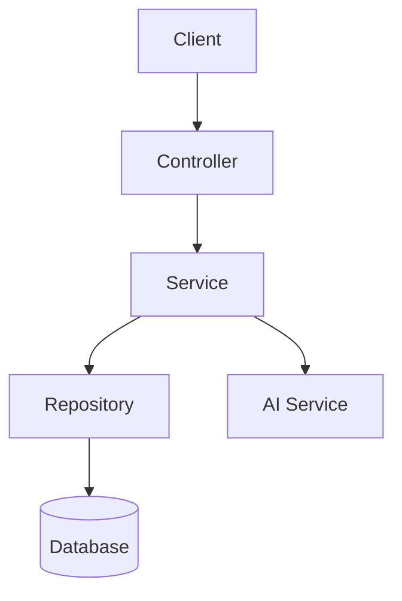
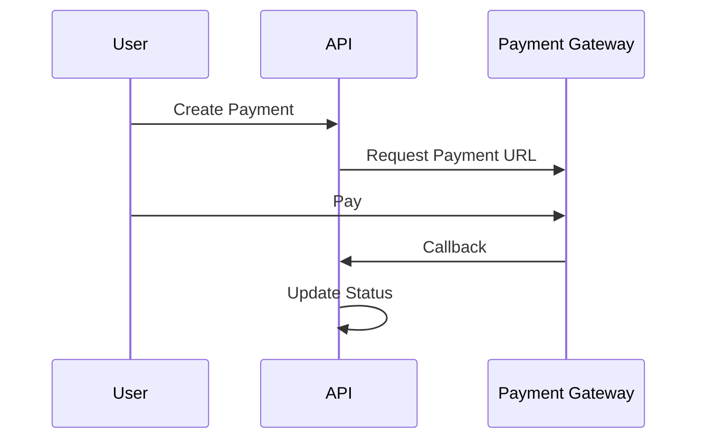
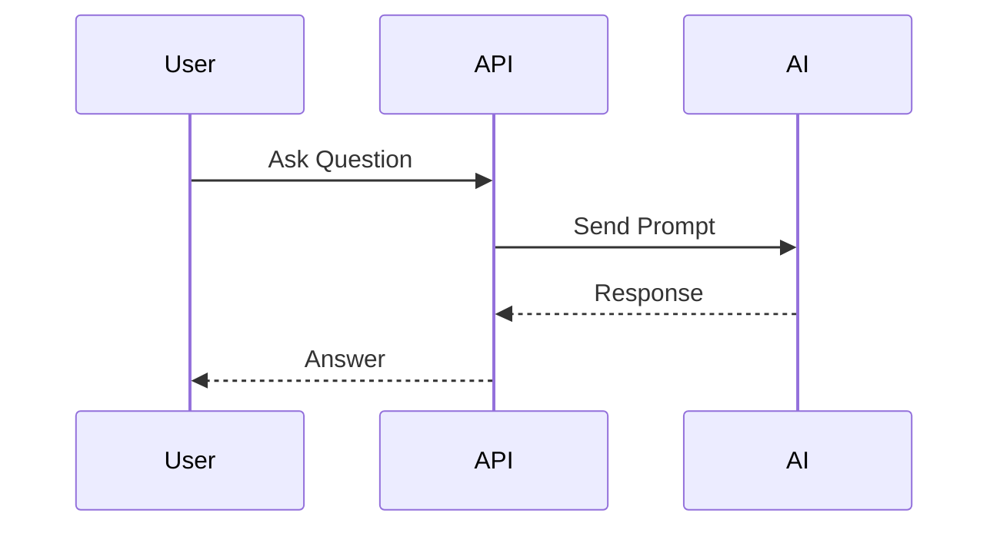

[README_SDLS.md](https://github.com/user-attachments/files/26450317/README_SDLS.md)
# 🚗 Smart Driving Learning System (SDLS)

<p align="center">
  
  
  
  
  
</p>

---

## 🌟 Overview

**Smart Driving Learning System (SDLS)** is an intelligent platform for learning and practicing driving theory, integrated with AI to personalize the learning experience.

💡 The system is built with an **API-first approach**, making it easy to scale and integrate with frontend applications (React, Vue, Mobile Apps).

---

## ✨ Features

### 👤 User
- 🔐 Register / Login (JWT)
- 📝 Practice tests
- 📊 View results & progress
- 🤖 AI chatbot support

### 📚 Learning
- Topic-based learning
- Auto-generated quizzes
- AI-generated questions
- Weakness analysis

### 🤖 AI System
- Learning support chatbot
- Personalized recommendations
- Behavior analysis
- Smart exam generation

### 💳 Payment
- VNPay / PayOS integration
- Payment callback handling
- Payment status update

### 🛠️ Admin / Staff
- Content management
- User management
- Content approval
- Analytics dashboard

---

## 🧱 Architecture



Architecture pattern:

```
Controller → Service → Repository → Database
```

---

## 🖼️ Demo UI (Mockup)

### 📱 User Dashboard


### 🧠 AI Chatbot


### 📝 Quiz System


---

## ⚙️ Tech Stack

| Layer       | Technology |
|------------|------------|
| Backend     | ASP.NET Core (.NET 8) |
| Database    | PostgreSQL |
| ORM         | Entity Framework Core |
| Auth        | JWT Bearer |
| AI          | Gemini API / Ollama |
| DevOps      | Docker, Railway |
| Mapping     | AutoMapper |

---

## 🔑 Authentication

- JWT Bearer Token
- Role-based authorization:
  - Admin
  - Staff
  - User

---

## 🔄 Payment Flow



---

## 🤖 AI Flow



---

## 🚀 Getting Started

### 1. Clone repository
```
git clone <your-repo>
cd SDLS
```

### 2. Install dependencies
```
dotnet restore
```

### 3. Configure database

Edit `appsettings.json`:

```
"ConnectionStrings": {
  "DefaultConnection": "Host=...;Port=5432;Database=...;Username=...;Password=..."
}
```

### 4. Run migrations
```
dotnet ef database update
```

### 5. Run project
```
dotnet run
```

---

## 📡 API Documentation

Swagger:
```
https://localhost:<port>/swagger
```

---

## 📁 Project Structure

```
SDLS/
│
├── SDLS.API
│   ├── Controllers
│
├── SDLS.Services
│   ├── Interfaces
│   ├── Implementations
│
├── SDLS.Repositories
│   ├── Interfaces
│   ├── Implementations
│
├── SDLS.Model
│   ├── Models
│   ├── DTOs
│
└── SDLS.Database
```

---

## 🔮 Future Enhancements

- 📱 Mobile App (Flutter / React Native)
- 🧠 Advanced AI Recommendations
- 🎥 Video Learning
- 🏆 Gamification
- 🌐 Multi-language support

---

## 📄 License

This project is for educational purposes.

---

## ⭐ Highlights

> 🚀 Clean architecture  
> 🤖 Deep AI integration  
> ⚡ Optimized backend API  
> 🔥 Suitable for academic & production projects  
